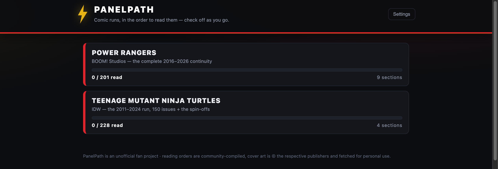
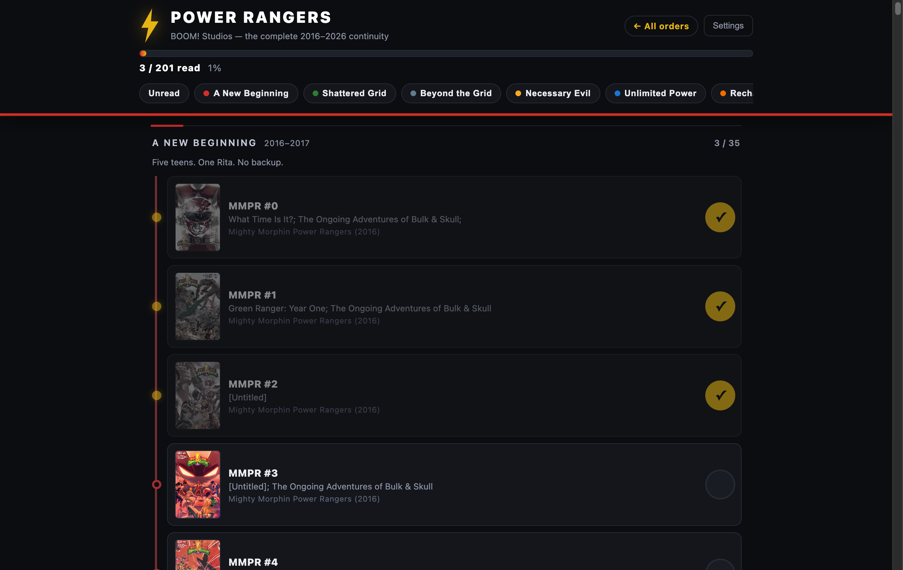

# PanelPath

[](https://github.com/gpmarinos114/panelpath/actions/workflows/docker.yml)
[](LICENSE)

**A self-hosted reading-order tracker for comics.** Pick a series, read it in the order it was meant to be read, and check off each issue as you go — one color-coded timeline per run, with cover art on every issue.



## What it is

Comics are published out of order: crossovers interleave, spin-offs slot between issues, and the "right" way through a run is rarely issue #1 → #N. PanelPath turns that into a simple checklist. Each **reading order** is one file; the app gives it a timeline view with cover art, section progress, and tap-to-check-off persistence that syncs across every device that opens it.

It ships with two community-compiled orders ready to go:

- **Power Rangers** — BOOM! Studios, the complete 2016–2026 continuity (201 items, deluxe-edition sequencing)
- **Teenage Mutant Ninja Turtles** — IDW, the 2011–2024 run (228 items: main series + spin-off mini-series)

More lines are data, not code — see *Adding a reading order* below, and [CONTRIBUTING.md](CONTRIBUTING.md).

## Features

- **Order library** — every comic line as its own color-coded timeline; hash-routed so the phone back button works
- **Tap to check off** — progress saved server-side per order (atomic writes, optimistic UI with rollback)
- **Sections** with progress counts and complete stamps; *Unread* filter; section jump chips
- **Cover fetching built in** — paste a free [ComicVine](https://comicvine.gamespot.com/api/) API key in Settings and the server pulls cover art for you, cached locally. Nothing copyrighted ships with the app.
- **Buy links** — each era links out to where it's collected in print (Amazon); optional per-instance affiliate tag, off by default.
- **Order builder** — create your own reading orders right in the app: search ComicVine for a series, add issues (range-select or one by one), pick section colors, attach buy links, preview, save. Drafts autosave as you go — resume or delete them from the home page, or discard one entirely from the builder. No JSON needed.
- Sticky progress bar, mobile-first layout, no accounts, no telemetry, no external calls at runtime



## Quickstart

### Docker (recommended)

```bash
docker run -d -p 5175:5175 \
  -v panelpath-data:/data \
  -e DATA_DIR=/data \
  -e PROGRESS_FILE=/data/progress.json \
  --name panelpath \
  ghcr.io/gpmarinos114/panelpath:latest
```

Or grab [`docker-compose.yml`](docker-compose.yml) and `docker compose up -d`. To build from source instead, use `build: .` in place of the image.

### Node

```bash
npm install
node server.js        # http://localhost:5175
```

## Updating

New reading orders and fixes ship inside the container image. To update:

```bash
docker compose pull && docker compose up -d
```

Your progress, settings and fetched covers live in the `panelpath-data` volume — updates never touch them. Only new order files and code arrive.

**Get notified when a new version ships:** on this repo, click **Watch → Custom → Releases**. Every release is built to `:latest` (and the `:1` major tag).

## Adding a reading order

**The easy way:** click **+ New order** on the home page. The in-app builder has ComicVine search, manual entry, per-section buy links and a live preview — and it writes a perfectly-formed order file into your `DATA_DIR/orders/` when you hit **Save order**. Great for private orders, and a shortcut for contributions (build it in-app, paste the resulting file into your PR).

**The file way:** reading orders live in `data/orders/<id>.json` — a list of sections, each with items:

```json
{
  "id": "my-series",
  "title": "My Series",
  "subtitle": "One line about the run",
  "credit": "Sources used to compile this order",
  "sections": [
    {
      "id": "S1", "name": "Part One", "years": "#1–10", "color": "#43a047",
      "items": [
        { "id": "my-001", "label": "My Series #1", "title": "Issue title",
          "series": "MS", "seriesName": "My Series (2020)", "num": "1",
          "cv": { "v": 123456, "i": 7890123 } }
      ]
    }
  ]
}
```

`cv` is optional — ComicVine volume/issue ids that power the cover fetcher. Full guide (including how to find those ids): [CONTRIBUTING.md](CONTRIBUTING.md).

Orders that land in this repo get bundled into the next image build — so everyone who updates gets the new lines. (You can also keep private orders of your own in `DATA_DIR/orders`; they override bundled ones and are never overwritten.)

## Configuration

| Env             | Default                    | Purpose                               |
| --------------- | -------------------------- | ------------------------------------- |
| `PORT`          | `5175`                     | HTTP port                             |
| `DATA_DIR`      | `./data`                   | Orders, progress, settings, covers    |
| `PROGRESS_FILE` | `<DATA_DIR>/progress.json` | Check-off state                       |
| `AMAZON_TAG`    | —                          | Optional Amazon Associates tracking ID appended to buy links |

Progress, settings and fetched covers live in `DATA_DIR` and survive container rebuilds.

## API

- `GET /api/orders` · `GET /api/orders/:id`
- `GET /api/progress` · `POST /api/progress` `{order, id, read}` · `POST /api/progress/reset` `{order?}`
- `GET /api/settings` · `POST /api/settings` `{key}`
- `POST /api/covers/fetch` `{order}` · `GET /api/covers/status`
- `GET /covers/:order/:item.jpg` · `GET /api/version`

## Credits & disclaimer

PanelPath is an **unofficial fan project** — not affiliated with or endorsed by any publisher. Reading orders are community-compiled; corrections welcome. Cover art belongs to the respective publishers and is fetched from ComicVine on your machine for personal reading tracking only.

Code is [MIT licensed](LICENSE).
